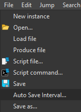

# IDA Pro Auto Save Plugin

IDA Pro plugin script for auto saving your database every 10 mins. You can change the interval in the script directly or per session using the dropdown menu (changing it to 0 disables it for the session).

## Install

Place the `autosave.py` scirpt in your IDA Pro / plugin install directory.

Tested on IDA Pro 9.